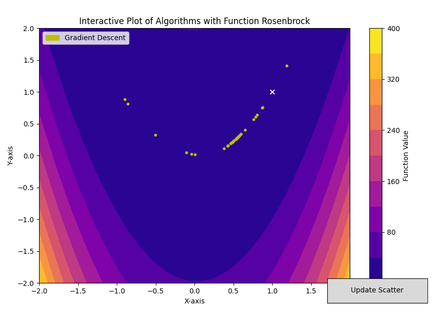
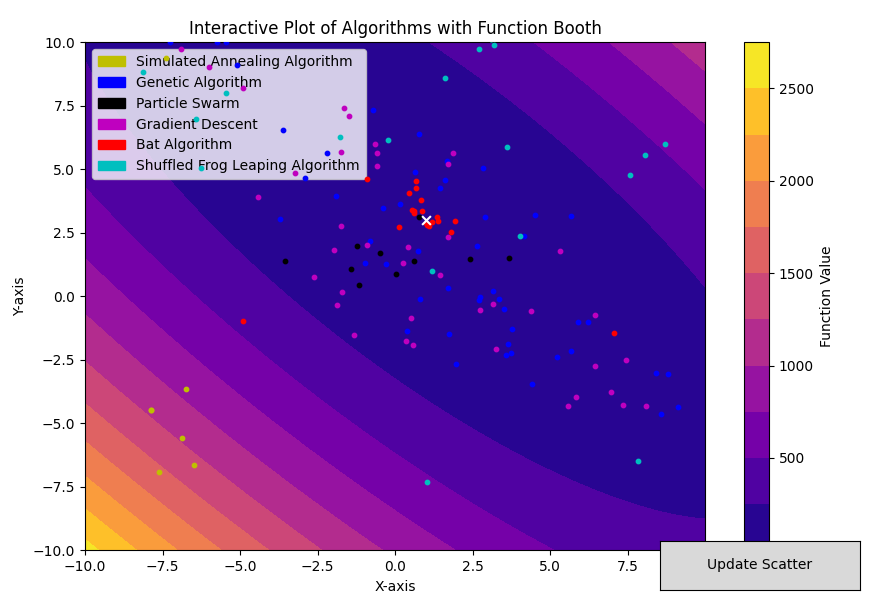
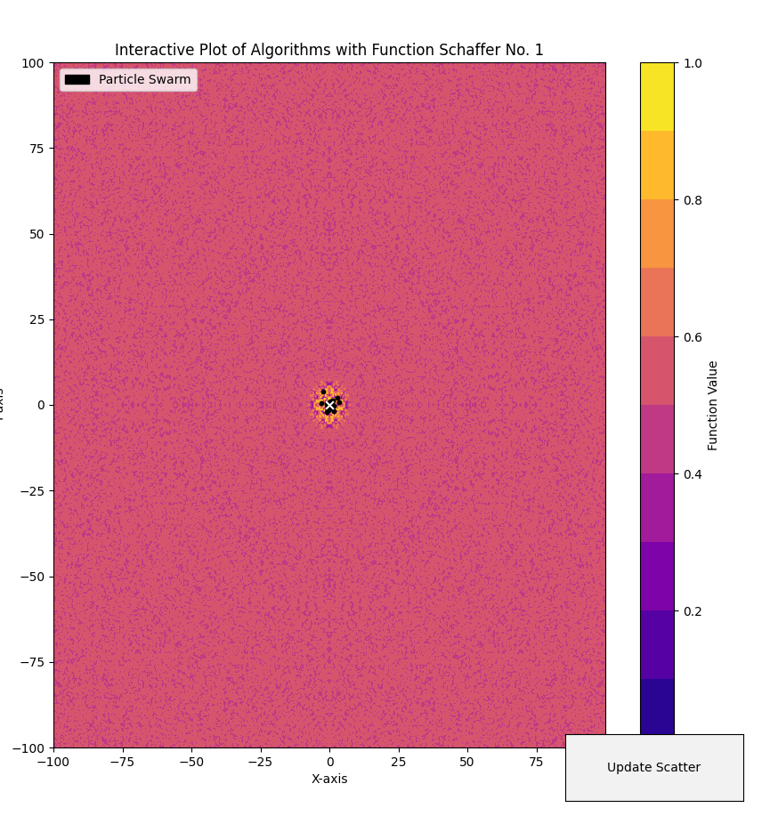
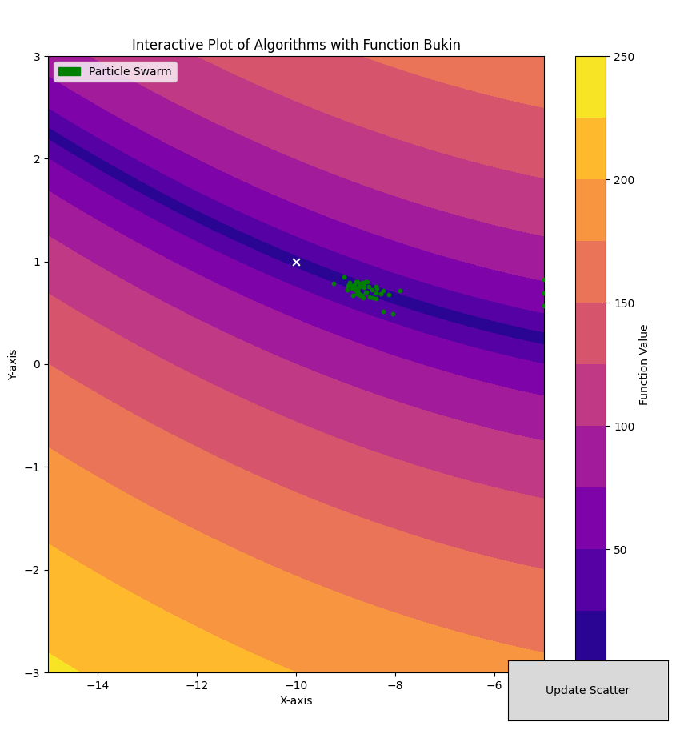
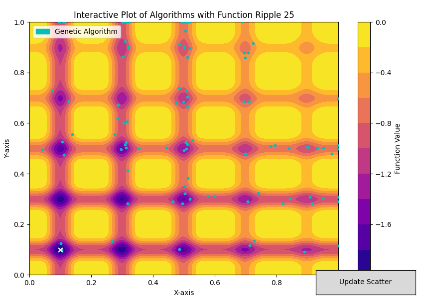
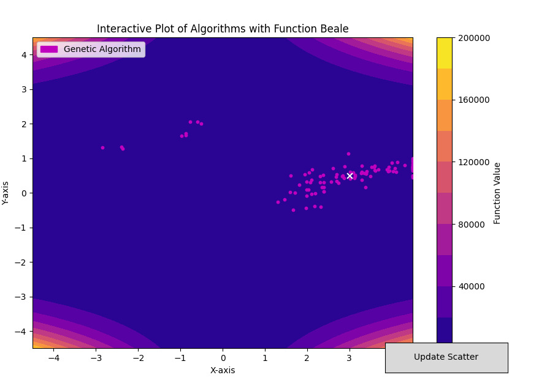
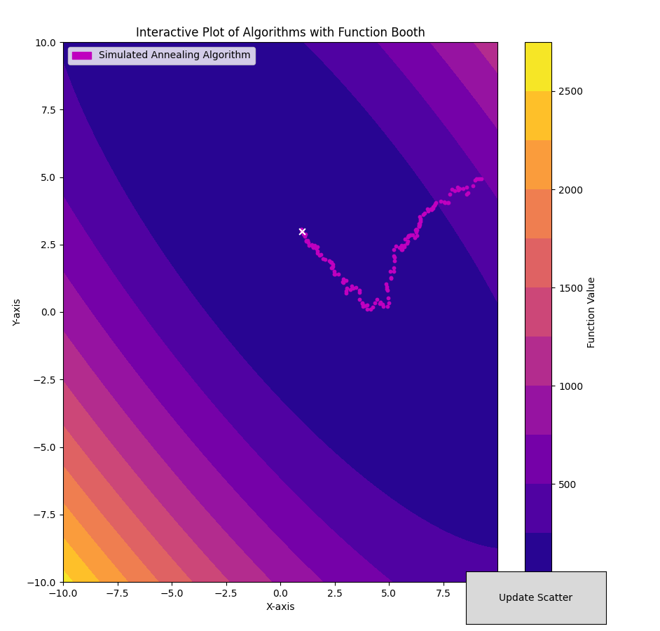
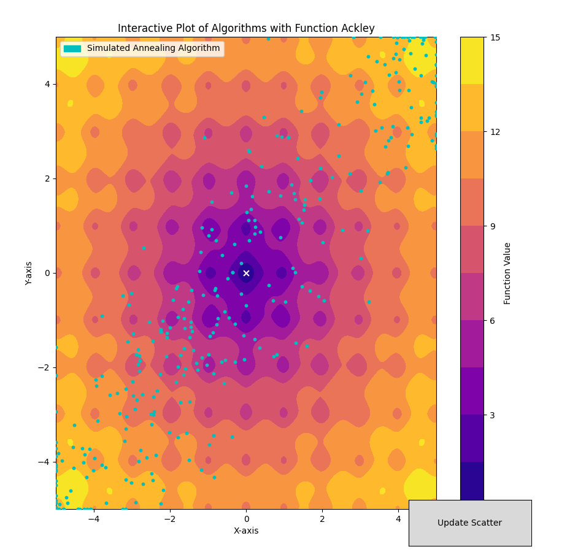
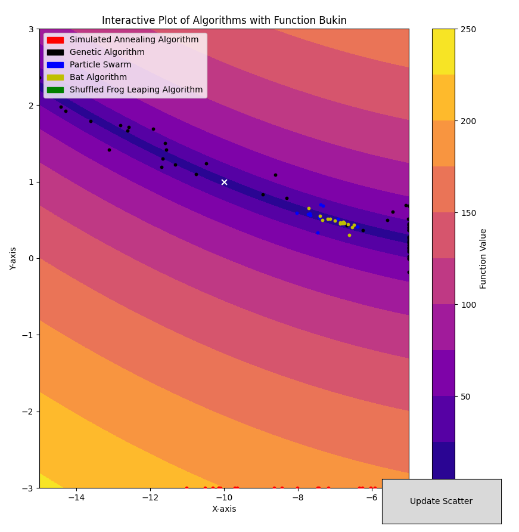

### Introducción

En este proyecto implementamos algoritmos de optimización para hallar mínimos globales de algunas funciones, algunos están basados en comportamientos de animales en la naturaleza como el *Bat Algorithm* que simula la eco-localización realizada por los murciélagos. Estos algoritmos son de punto fijo, con la abstracción de que en cada iteración tenemos algunos puntos en el dominio de la función, se actualizan la posición de estos puntos, se espera, pero no tiene por qué, que estas posiciones converjan a un mínimo global de la función. La diferencia entre estos algoritmos radica en la lógica usada para actualizar la posición de los puntos. El reto de estos algoritmos consiste en combinar tanto información global como información local de el espacio de búsqueda.

Un algoritmo que solamente usa información local sobre el espacio de búsqueda es el de *gradient descent*, en el cuál los puntos son actualizados de acuerdo a la dirección opuesta a el gradiente de la función en el punto, usar solamente información local, provoca que los puntos se estanquen en mínimos locales, pero no necesariamente globales.

Para comprobar el comportamiento de el algoritmo de *Gradient-Descent* usamos la función de *RosenBrock*, en la cual comprobamos que es fácil para el algoritmo encontrar la parábola donde se encuentra el mínimo, pero sin embargo el mínimo es más costoso encontrarlo.

Para visualizar el comportamiento de los algoritmos , Creamos un *contour* de una función de dos variables en un espacio acotado de búsqueda, además creamos una interfaz *Algoritmo* de forma que una implementación que cumpla con esta interfaz pueda ser usada en el plot interactivo, la forma en la que es usado es sencilla, son puntos son ploteados con un color asignado para distinguirlo de los otros, y mediante un botón son actualizadas las posiciones de los puntos. En caso de conocer un mínimo de la función lo marcamos con una $x$ en el gráfico, pero esto puede no significar mucho ya que las funciones pueden tener infinitas posiciones donde se alcanza el mínimo global.

A continuación explicamos se hará un análisis por separado de algunos de los algoritmos implementados:

#### Particle Swarm Optimization:

En este contexto partícula, ave, punto se refieren a una solución candidate en el espacio de búsqueda. El algoritmo comienza con una población de aves distribuidas uniformemente en el espacio de búsqueda, el movimiento de cada ave está influenciado por la mejor posición en la que ha estado ( menor valor de la función objetivo ) y la mejor posición de el grupo de aves en general. Esto combina el factor global y el factor local. Además se le añade un factor aleatorio a el movimiento de las aves.

En cada iteración la posición de las partículas es aumentado con el vector de velocidad de esta partícula, inicialmente este vector es 0, en cada iteración se recalcula este vector, se le añade a la posición de la partícula y se repite el proceso hasta que por alguna métrica se decida detener.

Para calcular la velocidad de la partícula se calculan tres componentes y se añaden, el algoritmo posee tres parámetros constantes que influencian cada una de estas velocidades, *inercia*, *aceleración personal*, *aceleración social*. Cada uno de estos controla que tanto aporta cada una de las tres velocidades: $i * v$, $a_p * R(0,1) * (G_p - P)$, $a_s * R(0,1) * (G - P)$ a el resultado final. Donde $i$ es la inercia, $v$ es la velocidad actual de la partícula, $a_p, a_s$ es la aceleración personal y social respectivamente. $R(0, 1)$ es un número al azar entre $0,1$. $G$ es la mejor posición global, $G_p$ es la mejor posición de la partícula y $P$ es la posición de la partícula.

A continuación algunas estadísticas con respecto a la ejecución de este algoritmo con algunas de las funciones ([código fuente](../src/notes/notes_pso.ipynb)) :

Particle Swarm Optimization with function Schaffer No. 2 and 100 runs
|                   |    Promedio |     Mediana |   Desv. Est. |
|:------------------|------------:|------------:|-------------:|
| Duración          | 0.117911    | 0.10801     |  0.0328831   |
| Error c.r. Mínimo | 1.20681e-15 | 0           |  4.67536e-15 |
| Error c.r. Óptimo | 0.000572421 | 0.000756713 |  0.000516296 |

Particle Swarm Optimization with function Schaffer No. 1 and 100 runs
|                   |    Promedio |     Mediana |   Desv. Est. |
|:------------------|------------:|------------:|-------------:|
| Duración          | 0.107815    | 0.100815    |  0.0216473   |
| Error c.r. Mínimo | 1.27565e-15 | 0           |  6.30023e-15 |
| Error c.r. Óptimo | 0.000557486 | 0.000681813 |  0.000527658 |

Podemos comprobar la eficacia de el algoritmo de Particle Swarm Optimization con la dos funciones anteriores dado que encontró el mínimo relativamente rápido y con desviación estándar baja, lo que significa estabilidad en el resultado. Sin embargo con la función Bukin no es capaz de encontrar el mínimo con la misma eficacia.

Particle Swarm Optimization with function Bukin and 100 runs
|                   |   Promedio |   Mediana |   Desv. Est. |
|:------------------|-----------:|----------:|-------------:|
| Duración          |  0.379757  | 0.307057  |     0.201252 |
| Error c.r. Mínimo |  0.0373831 | 0.0196273 |     0.05534  |
| Error c.r. Óptimo |  1.16795   | 1.59538   |     1.18843  |

Para realizar las estadísticas, establecimos como criterio de parada que el valor obtenido en la iteración sea lo suficientemente cercano a el promedio de los valores obtenidos en las últimas $30$ iteraciones, comprobar esta métrica es $0(1)$ y no afecta por tanto en el tiempo de la duración del algoritmo.

#### Shuffled Frog Leaping Algorithm (*SFLA*)

El Shuffled Frog Leaping Algorithm fue originalmente desarrollado para resolver problemas combinatoriales de optimización. El SFLA es una búsqueda cooperativa poblacional inspirado en meméticas de la naturaleza. El algoritmo contiene elementos de búsqueda local e intercambio de información global. Este consiste en una población virtual interactiva de ranas que es particionado en diferentes "memeplexes". Las ranas virtuales actúan como huéspedes o transportadores de los memes; donde un meme no es más que una unidad cultural de evolución (en nuestro caso, son vectores reales). El algoritmo realiza de forma simultánea e independiente una búsqueda local en cada memeplex (una característica que combina perfectamente con el paralelismo, utilizado en nuestra implementación). La búsqueda local es completada usando un método similar al "particle swarm" que enfatiza en la localidad. Para asegurar la exploración global, la ranas virtuales son periódicamente mezcladas y reorganizadas en nuevos memeplexes, una técnica similar a la mezcla utilizada en algoritmos evolutivos complejos. En adición, para proveer de una oportunidad para la generación aleatoria, ranas aleatorias son creadas y sustituidas en la población.

Dadas estas características del SFLA, y en particular su efectiva combinación de búsqueda local y global, decidimos seleccionarlo para optimizar las funciones de prueba; las cuales, en su mayoría, poseen más de un mínimo local (el SFLA es capaz de escaparlos para encontrar su camino hacia el mínimo global).

Los siguientes resultados fueron obtenidos tras realizar 100 ejecuciones del SFLA sobre las funciones de prueba ([código fuente](../src/notes/notes_sfla.ipynb)). Las datos comprenden: *duración*, *error con respecto al mínimo real* (valor absoluto), *error con respecto al punto óptimo real* (distancia euclidiana). En el caso de la función *Mishra 7* dado que la documentación carece del punto óptimo para **Mishra No. 7** (depende de los parámetros de la función -D, N-), decidimos en este caso computar el punto óptimo promedio, mediana y desviación estándar, respectivamente.

- **Mishra No. 7**

<table border="1" class="dataframe">
  <thead>
    <tr style="text-align: right;">
      <th></th>
      <th>Promedio</th>
      <th>Mediana</th>
      <th>Desv. Est.</th>
    </tr>
  </thead>
  <tbody>
    <tr>
      <th>Duración</th>
      <td>1.782274</td>
      <td>1.549789</td>
      <td>0.673887</td>
    </tr>
    <tr>
      <th>Error c.r. Mínimo</th>
      <td>0.0</td>
      <td>0.0</td>
      <td>0.0</td>
    </tr>
    <tr>
      <th>Óptimo</th>
      <td>[-4.7734454501962045, -7.0083927858275965]</td>
      <td>[-0.29500609426077473, -3.69811102335341]</td>
      <td>[13.982009466986847, 24.180827380772612]</td>
    </tr>
  </tbody>
</table>

- **Ripple No. 25**

Shuffled Frog Leaping Algorithm with function Ripple 25 and 20 runs
|                   |   Promedio |   Mediana |   Desv. Est. |
|:------------------|-----------:|----------:|-------------:|
| Duración          |  7.67244   | 5.67857   |    4.92076   |
| Error c.r. Mínimo |  0.0675795 | 0.0827661 |    0.0563752 |
| Error c.r. Óptimo |  0.142528  | 0.199435  |    0.107776  |

- **Schaffer No. 1**

Shuffled Frog Leaping Algorithm with function Schaffer 1 and 20 runs
|                   |    Promedio |     Mediana |   Desv. Est. |
|:------------------|------------:|------------:|-------------:|
| Duración          | 1.78227     | 1.54979     |  0.673887    |
| Error c.r. Mínimo | 1.34446e-10 | 0           |  5.81081e-10 |
| Error c.r. Óptimo | 0.00417204  | 0.000514606 |  0.0105829   |

- **Schaffer No. 2**

Shuffled Frog Leaping Algorithm with function Schaffer 2 and 20 runs
|                   |    Promedio |     Mediana |   Desv. Est. |
|:------------------|------------:|------------:|-------------:|
| Duración          | 2.07619     | 1.76073     |  0.86761     |
| Error c.r. Mínimo | 3.4972e-16  | 0           |  9.90699e-16 |
| Error c.r. Óptimo | 0.000566035 | 0.000476457 |  0.000382822 |

Como se puede observar por las estadísticas la función Ripple No 25 fue en la peor comportamiento tuvo el algoritmo. La duración para converger de este algoritmo es bastante, más de segundo y medio, comparada con los restantes algoritmos. En los últimos dos casos la desviación estándar es baja por lo que posee estabilidad.

## Algoritmo Genético: Differential Evolution (DE)

Differential Evolution (DE) es un algoritmo de optimización evolutivo, que pertenece a la misma familia de algoritmos que los Algoritmos Genéticos (GA). Se utiliza generalmente para funciones multidimensionales, donde el objetivo es encontrar el mínimo (o máximo) de una función objetivo. DE no utiliza el gradiente del problema que se optimiza, lo que significa que no requiere que el problema de optimización sea diferenciable.

El funcionamiento de este algoritmo procede de la siguiente forma: Comienza generando una población inicial de soluciones candidatas. Estas soluciones son vectores aleatorios generados dentro de los límites especificados para cada variable del problema. Cada individuo en la población representa una posible solución al problema. ***DE*** introduce la variación mediante una operación llamada mutación. Para cada vector de la población, se seleccionan aleatoriamente tres individuos diferentes. Se crea un nuevo vector (mutante) sumando la diferencia entre dos de estos vectores multiplicada por un factor de escalamiento (F) al tercero.

   $Mutante = Individuo_1 + F × (Individuo_2 − Individuo_3)$

   Después de la mutación, DE realiza un cruce entre el vector original y el vector mutante para crear un nuevo vector (trial vector). Se decide, para cada componente del vector, si se toma el valor del vector original o del mutante, basándose en una probabilidad predefinida (CR).

  $Trial Vector_i = 
  \begin{cases}
    Mutante_i & rand(0,1) \leq CR \\ 
    Individuo_i & else
  \end{cases}$

   Finalmente, se compara el valor de la función objetivo del nuevo vector generado con el del vector original. Si el nuevo vector tiene un valor de función objetivo mejor (menor para un problema de minimización), reemplaza al vector original en la población.

  $ Población_{i+1} = 
  \begin{cases}
  TrialVector_i & f(TrialVector_i) \leq f(Individuo_i) \\
  Individuo_i & else
   \end{cases} $

Estos pasos se repiten durante varias iteraciones hasta que se cumple algún criterio de parada, como alcanzar un número máximo de iteraciones o una mejora mínima en la solución.

Análogamente a como se hizo con los dos algoritmos anteriores :

- **Mishra No. 7**

<table border="1" class="dataframe">
  <thead>
    <tr style="text-align: right;">
      <th></th>
      <th>Promedio</th>
      <th>Mediana</th>
      <th>Desv. Est.</th>
    </tr>
  </thead>
  <tbody>
    <tr>
      <th>Duración</th>
      <td>0.511171</td>
      <td>0.502379</td>
      <td>0.157143</td>
    </tr>
    <tr>
      <th>Error c.r. Mínimo</th>
      <td>0.0</td>
      <td>0.0</td>
      <td>0.0</td>
    </tr>
    <tr>
      <th>Óptimo</th>
      <td>[-3.564216959455066, -4.946098783910625]</td>
      <td>[-3.9022491932996117, -3.8580251285997433]</td>
      <td>[14.050918134707134, 18.83150083646881]</td>
    </tr>
  </tbody>
</table>

- **Ripple No. 25**

<table border="1" class="dataframe">
  <thead>
    <tr style="text-align: right;">
      <th></th>
      <th>Promedio</th>
      <th>Mediana</th>
      <th>Desv. Est.</th>
    </tr>
  </thead>
  <tbody>
    <tr>
      <th>Duración</th>
      <td>0.003676</td>
      <td>0.003758</td>
      <td>0.001106</td>
    </tr>
    <tr>
      <th>Error c.r. Mínimo</th>
      <td>0.370942</td>
      <td>0.334613</td>
      <td>0.259675</td>
    </tr>
    <tr>
      <th>Error c.r. Óptimo</th>
      <td>0.223265</td>
      <td>0.213952</td>
      <td>0.174356</td>
    </tr>
  </tbody>
</table>

- **Schaffer No. 1**

<table border="1" class="dataframe">
  <thead>
    <tr style="text-align: right;">
      <th></th>
      <th>Promedio</th>
      <th>Mediana</th>
      <th>Desv. Est.</th>
    </tr>
  </thead>
  <tbody>
    <tr>
      <th>Duración</th>
      <td>1.207910e-01</td>
      <td>1.208919e-01</td>
      <td>2.130545e-02</td>
    </tr>
    <tr>
      <th>Error c.r. Mínimo</th>
      <td>3.014743e-09</td>
      <td>2.015670e-09</td>
      <td>3.223648e-09</td>
    </tr>
    <tr>
      <th>Error c.r. Óptimo</th>
      <td>2.232652e-01</td>
      <td>2.139516e-01</td>
      <td>1.743564e-01</td>
    </tr>
  </tbody>
</table>

- **Schaffer No. 2**

<table border="1" class="dataframe">
  <thead>
    <tr style="text-align: right;">
      <th></th>
      <th>Promedio</th>
      <th>Mediana</th>
      <th>Desv. Est.</th>
    </tr>
  </thead>
  <tbody>
    <tr>
      <th>Duración</th>
      <td>1.046041e-01</td>
      <td>1.047817e-01</td>
      <td>1.936059e-02</td>
    </tr>
    <tr>
      <th>Error c.r. Mínimo</th>
      <td>2.837139e-09</td>
      <td>8.299219e-10</td>
      <td>3.360508e-09</td>
    </tr>
    <tr>
      <th>Error c.r. Óptimo</th>
      <td>4.006819e-02</td>
      <td>3.581660e-02</td>
      <td>1.714624e-02</td>
    </tr>
  </tbody>
</table>

Como es posible comprobar en la imagen este algoritmo fue capaz de encontrar el mínimo en el caso de la función Ripple 25, con buenos resultados con respecto a rapidez y estabilidad en los tres parámetros que estamos comprobando. 

## Simulated Annealing:

El algoritmo de Simulated Annealing es una técnica de optimización inspirada en el proceso de enfriamiento de metales fundidos. 

### Funcionamiento del Algoritmo

1. **Inicialización**: El algoritmo comienza con una solución inicial aleatoria dentro de los límites definidos.

2. **Iteraciones**: Se realiza un número máximo de iteraciones, en cada una se genera una nueva solución cercana a la actual.

3. **Evaluación**: La función objetivo se calcula para ambas soluciones (actual y nueva).

4. **Aceptación**: Si la nueva solución es mejor o tiene una probabilidad de ser aceptada (determinada por la temperatura), se adopta como nueva solución.

5. **Enfriamiento**: La temperatura disminuye gradualmente a lo largo de las iteraciones.

6. **Conclusión**: El algoritmo termina cuando la temperatura alcanza un valor mínimo o se supera el número máximo de iteraciones.

Algunas estadísticas con respecto a algunas de las funciones usando este algoritmo:

Simulated Annealing Optimization with function Booth and 100 runs
|                   |   Promedio |   Mediana |   Desv. Est. |
|:------------------|-----------:|----------:|-------------:|
| Duración          |  0.0261428 | 0.0224447 |    0.0152329 |
| Error c.r. Mínimo | 41.6415    | 0.202242  |  137.499     |
| Error c.r. Óptimo |  0.330224  | 1.66653   |    3.26605   |

Simulated Annealing Optimization with function Ackley and 100 runs
|                   |   Promedio |   Mediana |   Desv. Est. |
|:------------------|-----------:|----------:|-------------:|
| Duración          |  0.0596633 | 0.0585796 |    0.0300218 |
| Error c.r. Mínimo |  1.14211   | 0.916012  |    0.762367  |
| Error c.r. Óptimo |  0.148169  | 0.195648  |    0.175354  |

Simulated Annealing Optimization with function Beale and 100 runs
|                   |   Promedio |   Mediana |   Desv. Est. |
|:------------------|-----------:|----------:|-------------:|
| Duración          |  0.0237364 | 0.0205396 |     0.012358 |
| Error c.r. Mínimo | 15.9937    | 0.495764  |    49.5673   |
| Error c.r. Óptimo |  0.746825  | 1.40831   |     2.01103  |

## Valoración

Los puntos óptimos encontrados varían significativamente entre ejecuciones, indicando que el algoritmo puede converger a diferentes soluciones óptimas dependiendo de la configuración inicial y las iteraciones realizadas.

### Conclusiones

Pudimos comprobar y visualizar los métodos usados por estos algoritmos en su mayoría estocásticos para encontrar el mínimo global de una función, algunos resultan mejores que otros dependiendo de las funciones escogidas. Con la función Bukin apreciamos que tan díficil puede resultar encontrar este mínimo global.

