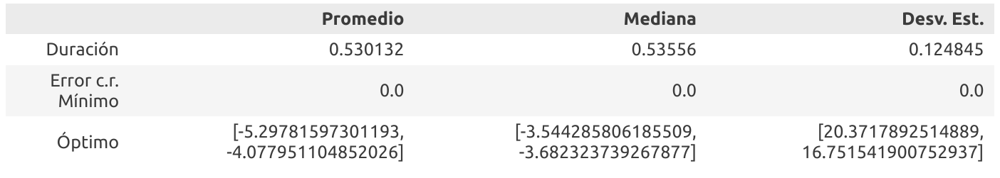
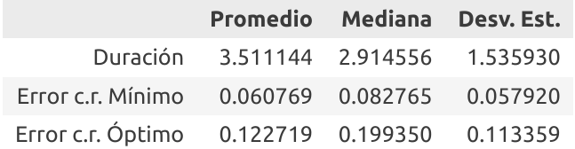
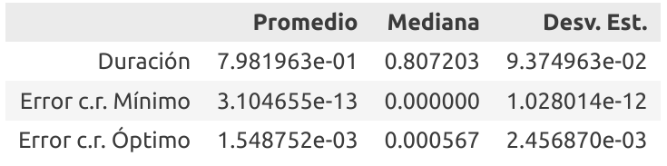

### Introducción

En este proyecto implementamos algoritmos de optimización para hallar mínimos globales de algunas funciones, algunos están basados en comportamientos de animales en la naturaleza como el *Bat Algorithm* que simula la ecolocalización realizada por los murciélagos. Estos algoritmos son de punto fijo, con la abstracción de en cada iteración tenemos algunos puntos en el dominio de la función, en cada iteración actualizamos la posición de estos puntos, se espera, pero no tiene por qué, que estas posiciones converjan a un mínimo global de la función. La diferencia entre estos algoritmos radica en la forma en que actualizan estos puntos. El reto de estos algoritmos consiste en combinar tanto información global como información local de el espacio de búsqueda.

Un algoritmo que solamente usa información local sobre el espacio de búsqueda es el de *gradient descent*, en el cuál los puntos son actualizados de acuerdo a la dirección opuesta a el gradiente de la función en el punto, usar solamente información local, provoca que los puntos se estanquen en mínimos locales, pero no necesariamente globales.

Para visualizar nuestra implementación, son ploteados los puntos en un *contour* de una función de dos variables en un espacio acotado de búsqueda, además creamos una interfaz para escoger que algoritmo usar, pudiendo usar un algoritmo o dos para ver las diferencias entre ellos.

A continuación explicamos en que consiste cada uno de los algoritmos usados:

#### Particle Swarm Optimization:

En este contexto partícula, ave, punto se refieren a una solución candidate en el espacio de búsqueda. El algoritmo comienza con una población de aves distribuidas uniformemente en el espacio de búsqueda, el movimiento de cada ave está influenciado por su la mejor posición en la que ha estado ( menor valor de la función objetivo ) y la mejor posición de el grupo de aves en general. Esto combina el factor global y el factor local.

En cada iteración la posición de las partículas es aumentado con el vector de velocidad de esta partícula, inicialmente este vector es 0, en cada iteración se recalcula este vector, se le añade a la posición de la partícula y se repite el proceso.

Para calcular la velocidad de la partícula se calculan tres componentes y se añaden, el algoritmo posee tres parámetros constantes que influencian cada una de estas velocidades, *inercia*, *aceleración personal*, *aceleración social*. Cada uno de estos controla que tanto aporta cada una de las tres velocidades a el resultado final:

    - $i * v$
    - $a_p * R(0,1) * (G_p - P)$
    - $a_s * R(0,1) * (G - P)$

Donde $i$ es la inercia, $v$ es la velocidad actual de la partícula, $a_p, a_s$ es la aceleración personal y social respectivamente. $R(0, 1)$ es un número al azar entre $0,1$. $G$ es la mejor posición global, $G_p$ es la mejor posición de la partícula y $P$ es la posición de la partícula.

#### Bat Algorithm

#### Shuffled Frog Leaping Algorithm (*SFLA*)

El Shuffled Frog Leaping Algorithm fue originalmente desarrollado para resolver problemas combinatoriales de optimización. El SFLA es una búsqueda cooperativa poblacional inspirado en meméticas de la naturaleza. El algoritmo contiene elementos de búsqueda local e intercambio de información global. Este consiste en una población virtual interactiva de ranas que es particionado en diferentes "memeplexes". Las ranas virtuales actúan como huéspedes o transportadores de los memes; donde un meme no es más que una unidad cultural de evolución (en nuestro caso, son vectores reales). El algoritmo realiza de forma simultánea e independiente una búsqueda local en cada memeplex (una característica que combina perfectamente con el paralelismo, utilizado en nuestra implementación). La búsqueda local es completada usando un método similar al "particle swarm" que enfatiza en la localidad. Para asegurar la exploración global, la ranas virtuales son periódicamente mezcladas y reorganizadas en nuevos memeplexes, una técnica similar a la mezcla utilizada en algoritmos evolutivos complejos. En adición, para proveer de una oportunidad para la generación aleatoria, ranas aleatorias son creadas y sustituidas en la población.

Dadas estas características del SFLA, y en particular su efectiva combinación de búsqueda local y global, decidimos seleccionarlo para optimizar las funciones de prueba; las cuales, en su mayoría, poseen más de un mínimo local (el SFLA es capaz de escaparlos para encontrar su camino hacia el mínimo global).

Los siguientes resultados fueron obtenidos tras realizar 20 ejecuciones del SFLA sobre las funciones de prueba. Las datos comprenden: *duración*, *error con respecto al mínimo real* (valor absoluto), *error con respecto al punto óptimo real* (distancia euclidiana).

- **Mishra No. 7**

- **Ripple No. 25**

- **Schaffer No. 2**

**Nota**: Dado que la documentación carece del punto óptimo para **Mishra No. 7** (depende de los parámetros de la función -D, N-), decidimos en este caso computar el punto óptimo promedio, mediana y desviación estándar, respectivamente.